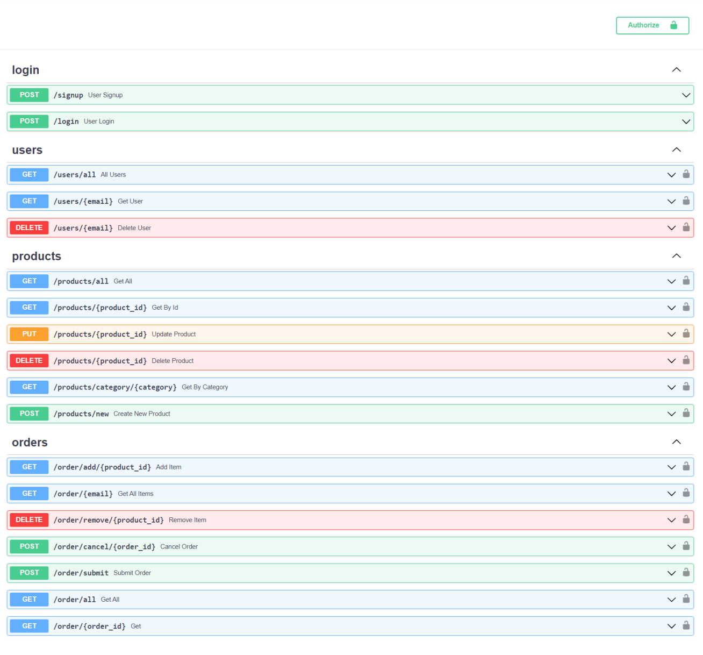

# E-commerce API

This application was built for educational purposes and is not intended for production use.

## Overview
E-commerce API built with FastAPI.

### Motives
The main reason for creating this application was to learn new technologies 
and build a real-world application from scratch.
The main emphasis was put at complex `SQLAlchemy` operations, table relationships, 
data migration with `Alembic` and complex authentication with `oauth2` and `JWTs`

#### Main features:
- Built with `FastAPI`
- Data storage in `SQLite` database with `SQLAlchemy`
- Database migration and versioning with `Alembic`
- User authentication with `oauth2` and JSON web tokens `JWT`
- Data validation with `Pydantic` models
- Password hashing with `CryptContext`
- Custom error handling
- Slack notification of new orders with async `httpx`
#### To be implemented:
- Asynchronous tasks processing with `Celery` and `RabbitMQ`


### E-commerce API
E-commerce API allows you to:

#### As a user: 
- Sign up and login to use services
- Search for products by id, name and category,
- Add items to cart,
- Remove items from cart,
- Get all items from cart,
- Cancel order,
- Submit order
#### As admin: 
- Get a list of all registered users
- Get user info
- Delete user's account
- Create new product
- Update product
- Delete product from inventory
- Get all orders
- Get order from order id


### Authentication
As a user you will need to signup. To access e-commerce related endpoints you will need to login with `Oauth2` and receive access token.

### Dependencies
Dependency management is handled using `requirements.txt` file. 

### Docker setup

1. Build a docker image: `docker build -t ecommerce_api .`
2. Start redis server with : `docker-compose up -d --build --force-recreate ecommerce_api`
3. Create a running container: `docker run -p 80:80 ecommerce_api`

### Local setup

1. Install dependencies from `requirements.txt` file
2. Run the app: `uvicorn ecommerce_api.main:app --reload`

## Documentation
Once the application is up and running, you can access FastAPI automatic docs 
at index page.

### Admin endpoints

| Method | Endpoint               | Description             |
|--------|------------------------|-------------------------|
| GET    | /users/all             | Get all users           |
| GET    | /users/{email}         | Get user info           |
| DELETE | /users/{email}         | Delete user             |
| POST   | /products/new          | Create new product      |
| PUT    | /products/{product_id} | Update existing product |
| DELETE | /products/{product_id} | Delete product          |
| GET    | /order/all             | Get all orders          |
| GET    | /order/{order_id}      | Get an order            |

### User endpoints

| Method | Endpoint                      | Description                       |
|--------|-------------------------------|-----------------------------------|
| POST   | /signup                       | User sign up                      |
| POST   | /login                        | User login                        |
| GET    | /products/all                 | Get all products                  |
| GET    | /products/{product_id}        | Get a product                     |
| GET    | /products/category/{category} | Search products by category       |
| GET    | /order/add/{product_id}       | Add product to cart               |
| GET    | /order/{email}                | Returns all items in user's  cart |
| DELETE | /order/remove/{product_id}    | Removes item from cart            |
| POST   | /order/cancel/{order_id}      | Cancels order                     |
| POST   | /order/submit                 | Submit new order                  |


## Status codes

| Status code | Description                               |
|-------------|-------------------------------------------|
| 200         | success                                   |
| 400         | bad request, please check your request    |
| 401         | user unauthorized                         |
| 404         | not found                                 |
| 424         | external dependency failed                |
| 500         | internal server error, application failed |

## Testing
You can test api with `Postman` and `Insomnia`

## Examples
POST `/products/new`
```json
{
	"success": true,
	"message": null,
	"results": {
		"name": "iPhone 14 256GB",
		"quantity": 100,
		"category": "phones",
		"description": "New iPhone",
		"price": 1000.0,
		"id": "0f099782"
	}
}
```
GET `/products/all`
```json
{
	"success": true,
	"message": null,
	"results": {
		"name": "iPhone 14 256GB",
		"quantity": 93,
		"category": "phones",
		"description": "New iPhone",
		"price": 1000.0,
		"id": "0f099782"
	}
}
```
GET `/order/add/0f099782`
```json
{
	"success": true,
	"message": "Item added to cart",
	"results": null
}
```

## Swagger UI
